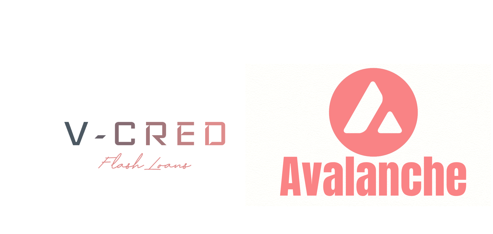

## V-Cred: Enabling flash loans in Avalanche
### Disclaimer: Flashloans are an advanced concept, and I have not added all safeguards since this is an MVP. Please do not use it in production.

This project aims to bring flashloans to Avalanche blockchain. The core concept V-Cred aims to use safer flash loan design pattern, and implementing it on side-chains.
Avalanche blockchain comprises of P-Chain, X-Chain and C-Chain. C-Chain or contract chain is evm compatible, contracts can deployed similar to mainnet using the same truffle toolkit. However there are important differences in the configuration. Since Ethereum bridge and Oracle support were not available at the time of this project, this is a template. Cred token an ERC-20 token was minted and was used as a medium of exchange to deploy and demonstrate flash loan capabilities.

The repository consists of solidity contracts as follows:
1. TokenCreator: Mints Cred token
2. TruffleConfig to deploy on Fuji testnet
3. Flashloan contract which inherits Ava flash borrower
4. Deposit pool contracts which inherits AVa flash lender

